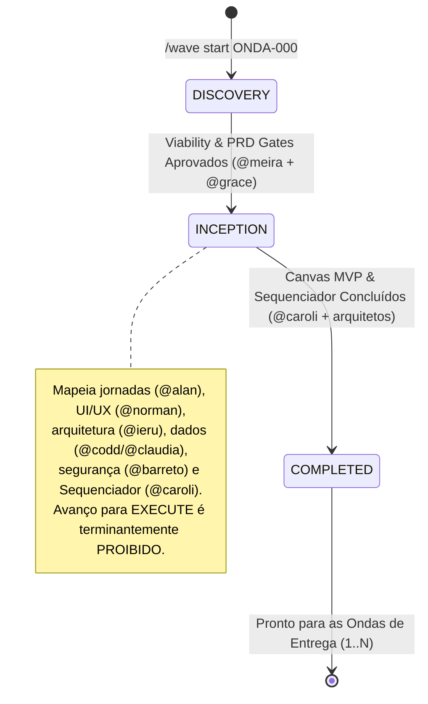
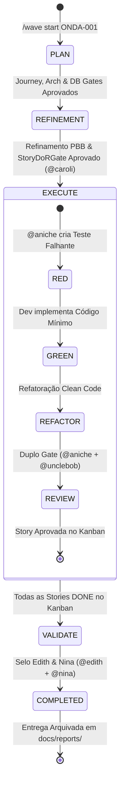

# ⚡ Bombe Code

> **Harness determinístico, local-first e de engenharia de software enterprise com IA.**

[](https://www.python.org/)
[](LICENSE)
[]()
[]()
[]()

---

## 🧭 O Que é o Bombe Code?

O **Bombe Code** é uma plataforma e harness de desenvolvimento que transforma múltiplos agentes autônomos de IA em uma equipe de engenharia de software coesa, disciplinada e previsível.

Inspirado no poder computacional e na precisão da máquina *Bombe* de Bletchley Park — projetada para decifrar problemas de altíssima complexidade combinatória através de especialização mecânica —, o Bombe Code elimina a fragilidade do chamado *"vibe coding"* desgovernado (código gerado sem planejamento, sem modelagem e sem testes reais).

No Bombe Code, nenhuma linha de código de produção é gerada ao acaso. O desenvolvimento segue a **Metodologia ONDA**, guiada por **24 Agentes Especialistas** e fiscalizada por **Gates Determinísticos do Turing Runtime**, onde a qualidade técnica é garantida por contratos de software em código Python imperativo, e não por promessas de modelos de linguagem.

---

## 🎯 A Premissa & Princípios Arquiteturais

### 1. Local-First & Independência Tecnológica
O Bombe Code opera prioritariamente na sua estação de trabalho:
* **Banco Local SQLite (`state.db`):** Armazena o estado do runtime, tarefas, cards do Kanban e checkpoints das ONDAS.
* **Transparência em Arquivos Físicos (`docs/`):** Todos os artefatos de PRDs, jornadas, decisões de arquitetura e histórias BDD são arquivos Markdown versionados no Git.
* **Zero Vendor Lock-in:** Suporte nativo tanto a modelos LLM locais (via [llama.cpp](https://github.com/ggerganov/llama.cpp) ou [Ollama](https://ollama.ai)) quanto a provedores de nuvem (Z.ai GLM-5.3-Flash, OpenAI, Anthropic, Google Gemini) via adaptadores padronizados PydanticAI.

### 2. As Duas Grandes Fases Canônicas: Upstream vs. Downstream
O desenvolvimento de software no Bombe Code é estruturado em duas fases indissociáveis (`WavePhase`):

```
                      ┌────────────────────────────────────────────────────────┐
                      │                   FASE 1: UPSTREAM                     │
                      │  (Descoberta, Viabilidade, Inception, Arquitetura,     │
                      │   Modelagem de Dados e Refinamento PBB de Stories)     │
                      │                                                        │
                      │  Etapas: DISCOVERY • INCEPTION • DISCUSS •             │
                      │          PLAN • REFINEMENT                             │
                      │  Regra: Código em src/ é terminantemente BLOQUEADO     │
                      └──────────────────────────┬─────────────────────────────┘
                                                 │
                                                 ▼
                                        [TURING QUALITY GATES]
                                 PRD • Journey • Arch • DB • DoR (INVEST)
                                                 │
                                                 ▼
                      ┌────────────────────────────────────────────────────────┐
                      │                  FASE 2: DOWNSTREAM                    │
                      │  (Engenharia por Stack, Ciclo TDD e Homologação)       │
                      │                                                        │
                      │  Etapas: EXECUTE • VALIDATE                            │
                      │  Regra: Implementação orientada a testes e duplo gate  │
                      └──────────────────────────┬─────────────────────────────┘
                                                 │
                                                 ▼
                                       [TURING REVIEW GATES]
                                @aniche (QA/Testes) + @unclebob (Clean Code)
                                      + @edith (Selo) + @nina (FinOps)
                                                 │
                                                 ▼
                                           PRONTO P/ PROD
```

* **Upstream:** Concepção determinística da solução antes de codificar. Se o problema de negócio não estiver claro, as telas não estiverem mapeadas, a arquitetura e modelo de dados não estiverem definidos e as histórias não atenderem ao **DoR (Definition of Ready)** e critérios **INVEST**, o Turing Runtime rejeita o avanço.
* **Downstream:** Construção sob **TDD Estrito** (`RED -> GREEN -> REFACTOR`). O código só é considerado pronto após validação automatizada e aprovação formal do Duplo Review Gate (`@aniche` para testes reais e `@unclebob` para Clean Code/SOLID), seguido da homologação contratual por `@edith` e auditoria de FinOps e conformidade por `@nina`.

### 3. Ontologia das Ondas: Onda 0 vs. Ondas de Entrega (1..N)
O ciclo de entrega no Bombe Code é classificado deterministicamente pela máquina de estados (`WaveType`):

* **Onda 0 (`WAVE_ZERO` — Greenfield Lean Inception Macro):**
  * **Identificadores:** `ONDA-0`, `ONDA-00`, `ONDA-000`, `WAVE-0`, `WAVE-00`, `WAVE-000` (ou prefixos `ONDA-000-*`).
  * **Ciclo de Estados:** `DISCOVERY` ➔ `INCEPTION` ➔ `COMPLETED`.
  * **Natureza:** Estritamente **UPSTREAM**. Conduz pesquisa de viabilidade (`@meira`), PRD e visão de produto (`@grace`), jornadas do usuário (`@alan`), design system e wireframes (`@norman`), arquitetura de sistemas (`@ieru`), modelagem de dados relacional (`@codd`) e NoSQL/vetorial (`@claudia`), modelagem de ameaças STRIDE (`@barreto`), Lean Inception Macro com Canvas MVP e o **Sequenciador de Ondas** (`@caroli`), e alinhamento de contexto de IA (`@nelson`).
  * **Trava Arquitetural:** Transições para `EXECUTE` ou `VALIDATE` são **terminantemente PROIBIDAS** e geram `InvalidTransitionError`. A Onda Zero não gera código em `src/`; ela entrega a fundação autônoma para as ondas de desenvolvimento.
* **Ondas de Entrega 1..N e Brownfield (`DELIVERY_WAVE`):**
  * **Identificadores:** `ONDA-001`, `ONDA-002`, `WAVE-001` em diante, ou evolução de sistemas legados.
  * **Ciclo de Estados:** `PLAN` ➔ `REFINEMENT` ➔ `EXECUTE` ➔ `VALIDATE` ➔ `COMPLETED`.
  * **Natureza:** Fatias verticais executáveis de entrega de valor real.
  * **Refinamento PBB:** Em `REFINEMENT`, a fatia é decomposta pelo método PBB (*Product Backlog Building*) por `@caroli` em tarefas atômicas padronizadas (`FOUNDATION`, `DATABASE`, `CONTRACT`, `BACKEND_TDD`, `FRONTEND_UI`, `E2E_INTEGRATION`).
  * **Downstream TDD:** A implementação é executada sob o ciclo atômico de testes falhantes e código de produção pelas stacks especialistas (`@valim`, `@barbara`, `@scott`, `@ryan`, `@james`, `@ada`).

### 4. Gates Determinísticos do Turing
Modelos de linguagem são probabilisticamente criativos, mas a engenharia de software exige determinismo. O agente central **`@turing`** atua como fiscal de qualidade através de código Python imperativo:
* **ViabilityQualityGate & PRDQualityGate:** Garantem viabilidade técnica, problema, personas, critérios RICE e MVP Operacional.
* **JourneyGate:** Valida Entry Points, Fluxos de Navegação e Telas mapeadas.
* **ArchitectureGate & DatabaseQualityGate:** Valida as Decisões de Arquitetura (ADRs), separação de camadas, schemas SQL e modelos NoSQL.
* **StoryDoRGate:** Valida se cada história cumpre rigorosamente o INVEST, DoR e cenários BDD (*Dado / Quando / Então*).
* **TuringReviewGate:** Veta entregas se a suíte de testes falhar ou se houver objeções técnicas dos revisores (`@aniche` e `@unclebob`).
* **SealGate:** Emite o relatório de validação e selo de prontidão da ONDA (`@edith` e `@nina`).
* **Ciclo Autônomo de Vetos (`VetoReworkEngine`):** Nenhum veto para o processo. Quando um validador reprova, o Turing determinístico classifica a causa, **rastreia o autor do artefato** (PRD→`@grace`, story→`@caroli`, schema→`@codd`, testes→`@aniche`), devolve o bloqueio para ele corrigir o artefato upstream, **re-queima as stories afetadas no burn TDD** e dispara re-auditoria — em até 2 rodadas autônomas. O humano só é convocado, como último recurso, por uma **Dúvida de Negócio** estruturada.

### Verbosidade: Verboso por Padrão
O padrão é a **transparência total**: cada letra, cada bloco de raciocínio (`🧠`) e cada tool call (`🔧`) dos agentes é streamado ao vivo na TUI. Para um modo executivo silencioso (apenas anúncios de onda, etapas e vetos):
* `bombe-code tui --quiet` (flag de startup) ou `/verbosity quiet|verbose` na TUI (persistido no `.bombeconfig`).

---

## 👥 O Elenco Oficial: 24 Agentes Especialistas

O Bombe Code reúne 24 agentes especialistas de elite, homenageando 12 pioneiros proeminentes do Brasil e 12 expoentes internacionais seminais da computação. Cada agente atua com foco cirúrgico em sua disciplina:

### Upstream (Concepção, Arquitetura, Inception & Refinamento)

| Agente | Pioneiro Homenageado | País | Papel Especialista | Artefatos & Foco Principal |
| :--- | :--- | :--- | :--- | :--- |
| **`@meira`** | Silvio Meira | Brasil | Senior Research & Viability Analyst | `docs/briefings/viability.md` — Viabilidade técnica e análise de mercado |
| **`@grace`** | Grace Hopper | EUA | Lead Product Manager & Strategy Lead | `docs/briefings/PRD.md` — Visão de produto, RICE score e MVP Operacional |
| **`@alan`** | Alan Cooper | EUA | User Journey Architect | `docs/architecture/journey.md` — Entry points, jornadas e fluxos de tela |
| **`@norman`** | Don Norman | EUA | UI/UX Designer & Design Systems | `docs/architecture/ui-ux.md` — Heurísticas de Nielsen, wireframes e design tokens |
| **`@ieru`** | Roberto Ierusalimschy | Brasil | Principal Systems Architect | `docs/architecture/arch.md`, `docs/architecture/adr/` — Clean Arch e ADRs |
| **`@codd`** | Edgar F. Codd | UK | Relational Database Architect | `docs/architecture/db.md`, `migrations/` — Modelagem relacional e normalização |
| **`@claudia`** | Claudia B. Medeiros | Brasil | NoSQL & Vector Store Architect | `docs/architecture/db-nosql.md` — Bancos NoSQL, IA vetorial e grafos |
| **`@barreto`** | Paulo Barreto | Brasil | Principal Security Architect | `docs/security/threat-model.md` — Threat Modeling STRIDE e criptografia |
| **`@caroli`** | Paulo Caroli | Brasil | Agile Master & Flow Architect | `docs/backlog/` — Lean Inception Macro, Decomposição PBB e DoR INVEST |
| **`@nelson`** | Nelson Mattos | Brasil | Prompt Engineer & AI Specialist | Engenharia de contexto, system prompts e alinhamento de IA |

### Downstream (Execução TDD & Qualidade de Código)

| Agente | Pioneiro Homenageado | País | Papel Especialista | Artefatos & Foco Principal |
| :--- | :--- | :--- | :--- | :--- |
| **`@valim`** | José Valim | Brasil | Senior Elixir Backend Developer | `src/`, `tests/` — Backend Elixir, OTP, alta concorrência e BEAM |
| **`@barbara`** | Barbara Liskov | EUA | Senior Python & Go Developer | `src/`, `tests/` — APIs FastAPI, Pydantic v2, microserviços Go e concorrência |
| **`@scott`** | Scott Guthrie | EUA | Senior .NET Backend Developer | `src/`, `tests/` — ASP.NET Core 8+, C# 12, Minimal APIs e EF Core |
| **`@ryan`** | Ryan Dahl | EUA | Senior Node.js & TS Developer | `src/`, `tests/` — Node.js runtime, TypeScript Strict e APIs REST |
| **`@james`** | James Gosling | Canadá | Senior Java Backend Developer | `src/`, `tests/` — Java 21, Spring Boot 3+, Virtual Threads e Clean Arch |
| **`@ada`** | Ada Lovelace | UK | Senior Frontend Developer | `src/`, `tests/` — React 19, Tailwind CSS, Flutter e Acessibilidade |
| **`@diego`** | Diego Aranha | Brasil | AppSec & Offensive Security | Auditoria ofensiva, pentest, SAST/DAST e mitigação OWASP Top 10 |
| **`@aniche`** | Maurício Aniche | Brasil | Test Architect & QA Automation | `tests/` — TDD Estrito: plano de testes, testes falhantes RED e automação |
| **`@unclebob`** | Robert C. Martin | EUA | Tech Lead & Architectural Guardian | Clean Code, princípios SOLID, refatoração e Code Review de aprovação |
| **`@demi`** | Demi Getschko | Brasil | SRE & Infrastructure Engineer | Docker, infraestrutura local, redes, pipelines CI/CD e observabilidade |

### Downstream (Validação, Homologação & Maestro)

| Agente | Pioneiro Homenageado | País | Papel Especialista | Artefatos & Foco Principal |
| :--- | :--- | :--- | :--- | :--- |
| **`@edith`** | Edith Ranzini | Brasil | Contract & Deliverable Validator | `docs/reports/` — Auditoria do entregável contra o PRD e emissão do Selo |
| **`@nina`** | Nina Silva | Brasil | Gov, FinOps & AI Ethics Auditor | Auditoria de consumo de tokens, governança de custos e conformidade ética |
| **`@turing`** | Alan Turing | UK | Runtime Maestro & Orquestrador | Orquestração da ONDA, máquina de estados finita e guarda de gates |

---

## 🌊 O Ciclo de Vida da ONDA

A unidade fundamental de entrega no Bombe Code é a **ONDA**. Dependendo de estarmos iniciando um projeto novo (Greenfield) ou construindo fatias verticais de valor (Brownfield/Evolução), a máquina de estados executa fluxos determinísticos distintos:

### 1. Onda 0: Greenfield Lean Inception Macro (`WaveType.WAVE_ZERO`)

A **Onda 0** é estritamente **UPSTREAM**. Ela estabelece toda a fundação do produto e do sistema sem gerar código de produção em `src/`:



### 2. Ondas de Entrega 1..N e Brownfield (`WaveType.DELIVERY_WAVE`)

As **Ondas de Entrega** pegam uma fatia vertical definida no Sequenciador e constroem software funcional production-ready sob rigoroso TDD:



### 3. O Ciclo Atômico de TDD em EXECUTE
Dentro da etapa `EXECUTE`, cada história de usuário atravessa um ciclo determinístico inquebrável:
1. **RED (`@aniche`):** O arquiteto de testes escreve testes unitários e de integração que falham deterministicamente.
2. **GREEN (Dev da Stack):** O especialista da linguagem (`@valim`, `@barbara`, `@scott`, `@ryan` ou `@james`) ou frontend (`@ada`) implementa a quantidade mínima de código necessária para fazer os testes passarem.
3. **REFACTOR (`@unclebob`):** O código é refatorado para atender aos princípios Clean Code, SOLID e eliminação de duplicidades.
4. **REVIEW GATE (`@aniche` + `@unclebob`):** Dupla aprovação estrita obrigatória. `@aniche` roda a suíte de testes real (sem mocks artificiais) e `@unclebob` valida a arquitetura. Se qualquer um reprovar, a história é bloqueada no Kanban (`BLOCKED`) até correção.

---

## 🎛️ Modos de Engenharia & Autonomia

O Bombe Code equilibra disciplina industrial com agilidade imediata:

### Modos de Engenharia
* **`tdd-code` (Padrão — Engenharia Formal):**
  * Rigor determinístico máximo.
  * Travas rígidas por etapa via `StageGuard`: código de produção em `src/` é bloqueado em `DISCUSS`, `DISCOVERY`, `PLAN`, `INCEPTION` e `REFINEMENT`.
  * Ciclo atômico `RED` ➔ `GREEN` ➔ `REFACTOR` ➔ `REVIEW`.
  * **Navegação Contextual com `Tab`:** A tecla `Tab` cicla as etapas válidas para o tipo de onda ativa:
    * Na Onda 0: cicla entre `DISCOVERY` e `INCEPTION`.
    * Nas Ondas de Entrega: cicla entre `PLAN`, `REFINEMENT`, `EXECUTE` e `VALIDATE`.
* **`vibe-code` (Chave Mestra `Shift + Tab` — Prototipagem Livre):**
  * Alternado instantaneamente com **`Shift + Tab`** (ou comando `/mode vibe`).
  * Liberdade total: sem etapas, sem travas de arquivo e sem cerimônias. A LLM executa diretamente qualquer script, código ou refatoração solicitada.
  * Indicador em **VERMELHO VIVO** na status bar (`Modo: [VIBE]`).
  * No modo `vibe-code`, a tecla **`Tab` NÃO cicla etapas** (fica reservada para autocompletar `/comandos` ou `@arquivos`).
  * Pressionar `Shift + Tab` novamente restaura com precisão o modo `tdd-code` e a última etapa ativa.

### Níveis de Autonomia
* **`AUTO`:** A ONDA progride autonomamente através das stories enquanto os gates forem aprovados.
* **`SEMI_AUTO` (Recomendado):** O runtime executa uma story completa, realiza os testes e reviews e pausa para confirmação do desenvolvedor humano antes de prosseguir.
* **`MANUAL`:** Cada comando e transição requer acionamento explícito.

---

## 🧱 Starters & Snippets (LEGO System)

O Bombe Code inclui um motor de scaffolding e um catálogo de blocos reutilizáveis para acelerar o desenvolvimento com arquiteturas corporativas consolidadas.

### Starters de Arquitetura Limpa
Inicie projetos prontos para produção com um único comando:
* `python-fastapi-clean`: FastAPI + Pydantic v2 + SQLAlchemy + Pytest.
* `go-gin-clean`: Go 1.22+ + Gin + Clean Architecture + Go Testing.
* `node-ts-clean`: Node.js + TypeScript Strict + Express + Vitest.
* `react-tailwind-clean`: React 19 + Vite + Tailwind CSS + Lucide Icons.

```bash
# Na TUI ou CLI interativa:
/project starter python-fastapi-clean meu-microsservico
```

### Snippets LEGO
Módulos reutilizáveis e testados que podem ser consultados e injetados pelas LLMs durante a codificação:
* `python/jwt_auth`: Autenticação JWT com expiração e claims.
* `python/healthcheck`: Health check determinístico com liveness e readiness probes.
* `go/jwt_auth`: Middleware de autenticação JWT idiomático em Go.
* `node/jwt_auth`: Utilitário de autenticação JWT assíncrono em TypeScript.

---

## 🖥️ Experiência de Terminal (TUI) Moderna & Autônoma

A TUI do Bombe Code foi desenhada para paridade visual e de desempenho com ferramentas de ponta (como OpenCode original e Claude Code):

* **⚡ Streaming Real Token-a-Token:** Pipeline reativo assíncrono via SSE (`text-delta`) que renderiza as respostas progressivamente conforme geradas pela nuvem ou modelos locais, sem acumular em blocos estáticos.
* **🧠 Suporte Nativo a Reasoning Stream (`reasoning-delta`):** Para modelos com raciocínio analítico integrado (ex: **GLM-5.3-Flash** da Z.ai, DeepSeek R1, Claude 3.7 Sonnet e OpenAI o1/o3-mini), os pensamentos do modelo fluem na tela ao vivo em painel dedicado antes da resposta final ser produzida.
* **🛡️ Arquitetura Anti-Freezing (30-60 FPS):** Renderização de alta frequência controlada (*throttled streaming* a ~35ms) que elimina re-parsing desnecessário de Markdown durante a recepção de tokens. A TUI nunca trava, mantendo CPU baixa e permitindo que atalhos como `Ctrl+Q` e `Ctrl+C` respondam instantaneamente.
* **📝 Caixa de Entrada Multilinha com Auto-Grow:** Suporte completo para colar textos extensos (inclusive prompts de ChatGPT, Claude ou especificações complexas) com preservação de quebras de linha. Cresce dinamicamente de 3 a 8 linhas. Pressione `Enter` para enviar ou `Shift+Enter` para nova linha.
* **⏳ Indicador Dinâmico de Pensamento (`ThinkingWidget`):** Ampulheta animada (`⏳` ➔ `⌛`) e pontinhos de status que fornecem feedback visual contínuo enquanto a IA prepara a primeira palavra.
* **🤝 Orientação Didática para Usuários:** Comandos acionados sem argumentos fornecem instruções passo a passo, orientando como iniciar uma ONDA ou configurar provedores sem suposições.

---

## 🔌 Provedores de Inteligência Artificial

O Bombe Code conta com resolução hierárquica e tolerância a falhas:
* **Z.ai / Zhipu AI (GLM-5.3-Flash):** Provedor prioritário oficial pré-configurado, com suporte nativo a streaming de altíssima velocidade e cadeias de raciocínio.
* **Nuvem Padrão:** OpenAI (`gpt-4o`), Anthropic (`claude-3-5-sonnet`), OpenRouter e Groq.
* **Local-First:** Suporte nativo a `llama.cpp` e `Ollama` com detecção de endereços locais.
* **Zero Falhas Silenciosas:** Caso nenhum provedor esteja configurado, o Bombe Code não recorre a respostas falsas; ele orienta claramente o usuário através do comando `/connect` na TUI ou CLI.

---

## 🚀 Instalação e Primeiros Passos

### Pré-requisitos
* Python 3.12 ou superior instalado.
* Gerenciador de pacotes [`uv`](https://github.com/astral-sh/uv) (recomendado) ou `pip`.

### Instalação
```bash
# Instalação global recomendada via uv tool:
uv tool install --force .

# Ou via repositório de desenvolvimento:
git clone https://github.com/alexsandropontes/bombe-code.git
cd bombe-code
uv sync
```

### Execução da Interface (TUI & CLI)
```bash
# Inicie o Terminal Interativo (TUI):
bombe-code tui

# Ou execute comandos diretamente pela CLI:
bombe-code init                          # Inicializa o projeto local
bombe-code wave start ONDA-000          # Inicia a Onda 0 (Lean Inception Macro)
bombe-code wave start ONDA-001          # Inicia a primeira Onda de Entrega
bombe-code wave status                  # Exibe o status da ONDA e o Kanban
```

### Comandos Slash Comuns na TUI
* `/wave status`: Exibe o dashboard com os Gates do Turing e o Kanban das stories ativas.
* `/connect`: Abre o assistente para conectar provedores de IA e configurar chaves de API.
* `/mode [tdd|vibe]`: Alterna o modo de engenharia em tempo de execução (`Shift + Tab`).
* `/autonomy [auto|semi-auto|manual]`: Ajusta a autonomia do orquestrador.
* `/verbosity [verbose|quiet]`: Alterna a verbosidade do runtime (padrão: verboso, streama tudo).
* `/project starter [starter-id] [dir]`: Inicializa um novo projeto a partir de um starter oficial.
* `/snippet list`: Lista os blocos de código LEGO disponíveis no repositório.

---

## 🧪 Qualidade de Código & Testes

O desenvolvimento do Bombe Code é 100% aderente ao TDD:

```bash
# Executa a suíte completa de testes unitários e de integração
uv run pytest

# Executa linter e formatação estrita
uv run ruff check .
uv run ruff format --check .
```

---

## ⚠️ Disclaimer de Homenagens & Nomes

### Nomes e Homenagens

Os nomes, pseudônimos e referências a profissionais utilizados neste projeto são homenagens a pessoas que contribuíram significativamente para a computação, engenharia de software, ciência da computação e áreas afins.

A utilização desses nomes tem finalidade exclusivamente referencial, histórica e honorífica. Ela **não implica, não sugere e não representa** participação, colaboração, endosso, afiliação, patrocínio ou contribuição direta dessas pessoas para este projeto.

As personas e agentes que utilizam esses nomes são personagens conceituais criados exclusivamente para representar papéis dentro da arquitetura do Bombe Code. Suas opiniões, decisões, comportamentos e instruções são definidos pelas regras do framework e não representam necessariamente as opiniões ou posições das pessoas homenageadas.

Os nomes foram escolhidos por sua notoriedade e pioneirismo nas respectivas áreas técnicas. O projeto não pretende reproduzir, simular ou se passar pelas pessoas homenageadas.

> **Aviso Específico:** Uma persona denominada `@turing`, `@unclebob`, `@grace`, `@valim` ou qualquer outra referência nominal **não constitui** uma representação digital, réplica ou simulação da pessoa homenageada.

Para o catálogo detalhado das 23 pessoas homenageadas e seus contextos históricos, consulte a documentação em [`docs/architecture/agents-homage.md`](docs/architecture/agents-homage.md).

---

## 📄 Licença

Distribuído sob a licença MIT. Consulte `LICENSE` para mais detalhes.
