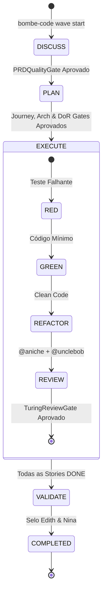

# ⚡ Bombe Code

> **Harness soberano, local-first e determinístico de inteligência artificial para engenharia de software enterprise.**

[](https://www.python.org/)
[](LICENSE)
[]()
[]()
[]()

---

## 🧭 O Que é o Bombe Code?

O **Bombe Code** é uma plataforma e harness de desenvolvimento que transforma múltiplos agentes autônomos de IA em uma equipe de engenharia de software coesa, disciplinada e previsível.

Inspirado no poder computacional e na precisão da máquina *Bombe* de Bletchley Park — projetada para decifrar problemas de altíssima complexidade combinatória através de especialização mecânica —, o Bombe Code elimina a fragilidade do chamado *"vibe coding"* (códigos gerados sem planejamento, sem modelagem e sem testes reais).

No Bombe Code, nenhuma linha de código de produção é gerada ao acaso. O desenvolvimento segue a **Metodologia ONDA**, guiada por **23 Agentes Especialistas** e fiscalizada por **Gates Determinísticos do Turing Runtime**, onde a qualidade técnica é garantida por contratos de software em código Python, e não por promessas de modelos de linguagem.

---

## 🎯 A Premissa & Princípios Arquiteturais

### 1. Local-First & Soberania Tecnológica
O Bombe Code opera prioritariamente na sua estação de trabalho:
* **Banco Local SQLite (`state.db`):** Armazena o estado do runtime, tarefas, cards do Kanban e checkpoints das ONDAS.
* **Transparência em Arquivos Físicos (`docs/`):** Todos os artefatos de PRDs, jornadas, decisões de arquitetura e histórias BDD são arquivos Markdown versionados no Git.
* **Zero Vendor Lock-in:** Suporte nativo tanto a modelos LLM locais (via [llama.cpp](https://github.com/ggerganov/llama.cpp) ou [Ollama](https://ollama.ai)) quanto a provedores de nuvem (OpenAI, Anthropic, Google Gemini) via adaptadores padronizados PydanticAI.

### 2. Separação Rigorosa: Upstream vs. Downstream
O desenvolvimento de software no Bombe Code é dividido em duas metades indissociáveis:

```
                      ┌────────────────────────────────────────────────────────┐
                      │                   FASE 1: UPSTREAM                     │
                      │  (Descoberta, Viabilidade, Jornada e Especificação)    │
                      └──────────────────────────┬─────────────────────────────┘
                                                 │
                                                 ▼
                                        [TURING GATES]
                                 PRD • Journey • Arch • DoR
                                                 │
                                                 ▼
                      ┌────────────────────────────────────────────────────────┐
                      │                  FASE 2: DOWNSTREAM                    │
                      │   (Engenharia por Stack, TDD Estrito e Duplo Review)   │
                      └──────────────────────────┬─────────────────────────────┘
                                                 │
                                                 ▼
                                      [TURING REVIEW GATE]
                                 @aniche (Testes) + @unclebob
                                                 │
                                                 ▼
                                           PRONTO P/ PROD
```

* **Upstream:** Concepção da solução antes de codificar. Se o problema de negócio não estiver claro, as telas não estiverem mapeadas e as histórias não atenderem ao **DoR (Definition of Ready)** e **INVEST**, o Turing rejeita o avanço.
* **Downstream:** Construção sob **TDD Estrito** (`RED -> GREEN -> REFACTOR`). O código só é considerado pronto após validação automatizada e aprovação formal de dois revisores independentes: qualidade de testes (`@aniche`) e arquitetura limpa (`@unclebob`).

### 3. Gates Determinísticos do Turing
Modelos de linguagem são probabilisticamente criativos, mas a engenharia de software exige determinismo. O agente central **`@turing`** atua como fiscal de qualidade através de código Python imperativo:
* **PRDQualityGate:** Garante a presença de Visão Geral, Problema, Personas, Critérios RICE e MVP Operacional.
* **JourneyGate:** Valida Entry Points, Fluxos de Navegação e Telas.
* **ArchitectureGate:** Valida as Decisões de Arquitetura (ADRs) e Stacks homologadas.
* **StoryDoRGate:** Valida se a história tem INVEST e cenários de aceite em sintaxe BDD (*Dado / Quando / Então*).
* **TuringReviewGate:** Veta entregas se a suíte de testes falhar ou se houver objeções técnicas dos revisores.

---

## 👥 O Elenco Oficial: 23 Agentes Especialistas

O Bombe Code organiza sua equipe em especialistas de papéis bem delimitados, garantindo profundidade em cada disciplina:

| Estágio | Agente | Papel Especialista | Foco Principal |
| :--- | :--- | :--- | :--- |
| **Maestro** | **`@turing`** | Runtime Master & Gatekeeper | Orquestração da ONDA, máquina de estados e fiscalização de gates |
| **DISCUSS** | **`@meira`** | Senior Research & Viability Analyst | Análise de viabilidade técnica, mercado e inovação tecnológica |
| **DISCUSS** | **`@grace`** | Lead Product Manager | Visão de produto, priorização RICE e elaboração do PRD |
| **PLAN** | **`@alan`** | User Journey Architect | Mapeamento de entry points, navegação e inventário de telas |
| **PLAN** | **`@norman`** | UI/UX Designer & Design Systems | Heurísticas de Nielsen, wireframes e design tokens |
| **PLAN** | **`@ieru`** | Principal Systems Architect | Arquitetura limpa, microsserviços, monolitos modulares e ADRs |
| **PLAN** | **`@codd`** | Relational Database Architect | Modelagem relacional, normalização, migrações e índices SQL |
| **PLAN** | **`@claudia`** | NoSQL & Vector Store Architect | Bancos de documentos, chave-valor e índices para IA vetorial |
| **PLAN** | **`@barreto`** | Security Architect & Threat Modeling | Modelagem de ameaças (STRIDE), criptografia e proteção de dados |
| **PLAN** | **`@caroli`** | Agile Master & Flow Architect | Quebra de histórias de usuário, critérios INVEST e DoR |
| **PLAN** | **`@nelson`** | Prompt Engineer & AI Context Specialist | Engenharia de contexto e alinhamento de system prompts |
| **EXECUTE** | **`@valim`** | Senior Elixir Backend Developer | Concorrência massiva, tolerância a falhas e arquitetura OTP |
| **EXECUTE** | **`@barbara`** | Senior Python & Go Backend Developer | APIs de alto desempenho, FastAPI, Pydantic, Concorrência Go |
| **EXECUTE** | **`@scott`** | Senior .NET Backend Developer | ASP.NET Core 8+, C# 12+, Minimal APIs e Entity Framework Core |
| **EXECUTE** | **`@ryan`** | Senior Node.js & TS Backend Developer | Runtime Node/TS, TypeScript Strict, APIs REST e microsserviços |
| **EXECUTE** | **`@james`** | Senior Java Backend Developer | Spring Boot 3+, Java 21, Virtual Threads e Clean Architecture |
| **EXECUTE** | **`@ada`** | Senior Frontend Developer | React, Tailwind CSS, componentes acessíveis e interfaces ricas |
| **EXECUTE** | **`@diego`** | AppSec Pentest & Vulnerability Auditor | Auditoria ofensiva, verificação SAST/DAST e OWASP Top 10 |
| **EXECUTE** | **`@aniche`** | Test Architect & QA Automation | Estratégia de testes unitários, integração, E2E e cobertura |
| **EXECUTE** | **`@unclebob`** | Tech Lead & Architectural Guardian | Clean Code, princípios SOLID, refatoração e integridade do código |
| **EXECUTE** | **`@demi`** | SRE & Infrastructure Engineer | Redes, containers Docker, pipelines CI/CD e observabilidade |
| **VALIDATE**| **`@edith`** | Contract & Deliverable Validator | Auditoria final do entregável contra o PRD e emissão do Selo |
| **VALIDATE**| **`@nina`** | Gov, FinOps & AI Ethics Auditor | Auditoria de custos de tokens, conformidade LGPD e ética em IA |

---

## 🌊 O Ciclo de Vida da ONDA

A unidade fundamental de entrega no Bombe Code é a **ONDA**. Uma ONDA é um pacote de valor completo que transita por cinco estágios sucessivos:



1. **`DISCUSS`:** O usuário ou time define um objetivo. `@meira` investiga a viabilidade e `@grace` redige o PRD estruturado com pontuação RICE. O `PRDQualityGate` inspeciona o documento.
2. **`PLAN`:** Os arquitetos entram em ação. `@alan` mapeia fluxos e telas; `@ieru` define as fronteiras de software; `@codd` ou `@claudia` criam o modelo de persistência; `@caroli` fatia a entrega em histórias com critérios BDD.
3. **`EXECUTE`:** O especialista da stack de tecnologia (`@valim`, `@barbara`, `@scott`, `@ryan` ou `@james`) e o frontend (`@ada`) executam cada história aplicando TDD estrito. Ao término, a dupla `@aniche` e `@unclebob` revisa o código.
4. **`VALIDATE`:** `@edith` valida o cumprimento do contrato inicial contra o PRD e `@nina` fiscaliza o consumo de tokens e a segurança ética.
5. **`COMPLETED`:** A ONDA é arquivada com relatório formal de validação emitido em `docs/reports/`.

---

## 🧱 Starters & Snippets (LEGO System)

O Bombe Code inclui um motor de scaffolding e um catálogo de componentes reutilizáveis para acelerar o início de novos serviços com arquiteturas corporativas consolidadas.

### Starters de Arquitetura Limpa
Inicie projetos prontos para produção com um único comando:
* `python-fastapi-clean`: FastAPI + Pydantic v2 + SQLAlchemy + Pytest.
* `go-gin-clean`: Go 1.22+ + Gin + Clean Architecture + Go Testing.
* `node-ts-clean`: Node.js + TypeScript Strict + Express + Vitest.
* `react-tailwind-clean`: React 19 + Vite + Tailwind CSS + Lucide Icons.

```bash
# Na TUI ou CLI interativa:
/project starter python-fastapi-clean meu-microsservico
```

### Snippets LEGO
Módulos reutilizáveis e testados que podem ser injetados ou consultados pelas LLMs durante a fase de codificação:
* `python/jwt_auth`: Autenticação JWT com expiração e claims.
* `python/healthcheck`: Health check determinístico com liveness e readiness probes.
* `go/jwt_auth`: Middleware de autenticação JWT idiomático em Go.
* `node/jwt_auth`: Utilitário de autenticação JWT assíncrono em TypeScript.

As LLMs contam com as ferramentas nativas `snippet_search` e `snippet_get` para incorporar esses blocos diretamente em suas soluções.

---

## 🎛️ Modos de Operação & Autonomia

O Bombe Code se adapta ao nível de controle desejado pelo engenheiro de software:

### Modos de Engenharia
* **`tdd-code` (Padrão):** Rigor máximo. É proibido gerar código de produção sem antes gerar um teste automatizado falhante (`RED`).
* **`vibe-code`:** Modo exploratório para prototipagem rápida e ideação inicial.

### Níveis de Autonomia
* **`AUTO`:** A ONDA progride autonomamente através das stories enquanto os gates forem aprovados.
* **`SEMI-AUTO` (Recomendado):** O runtime executa uma story completa, realiza os testes e reviews e pausa para confirmação do desenvolvedor humano antes de prosseguir.
* **`MANUAL`:** Cada comando e transição requer acionamento explícito.

---

## 🚀 Instalação e Primeiros Passos

### Pré-requisitos
* Python 3.12 ou superior instalado.
* Gerenciador de pacotes [`uv`](https://github.com/astral-sh/uv) (recomendado) ou `pip`.

### Instalação
```bash
# Clone o repositório
git clone https://github.com/alexsandropontes/bombe-code.git
cd bombe-code

# Sincronize as dependências com uv
uv sync
```

### Execução da Interface (TUI & CLI)
```bash
# Inicie o Terminal Interativo (TUI)
uv run bombe-code tui

# Ou execute comandos diretamente pela CLI:
uv run bombe-code init                          # Inicializa o projeto local
uv run bombe-code wave start ONDA-001          # Inicia uma nova ONDA
uv run bombe-code wave status                  # Exibe o status da ONDA e o Kanban
```

### Comandos Slash Comuns na TUI
* `/wave status`: Exibe o dashboard com os Gates do Turing e o Kanban das stories ativas.
* `/mode [tdd|vibe]`: Alterna o modo de engenharia em tempo de execução.
* `/autonomy [auto|semi-auto|manual]`: Ajusta a autonomia do orquestrador.
* `/project starter [starter-id] [dir]`: Inicializa um novo projeto a partir de um starter oficial.
* `/snippet list`: Lista os blocos de código LEGO disponíveis no repositório.

---

## 🧪 Qualidade de Código & Testes

O desenvolvimento do Bombe Code é 100% aderente ao TDD:

```bash
# Executa a suíte completa de testes unitários e de integração
uv run pytest

# Executa linter e formatação estrita
uv run ruff check .
uv run ruff format --check .
```

---

## ⚠️ Disclaimer de Homenagens & Nomes

### Nomes e Homenagens

Os nomes, pseudônimos e referências a profissionais utilizados neste projeto são homenagens a pessoas que contribuíram significativamente para a computação, engenharia de software, ciência da computação e áreas afins.

A utilização desses nomes tem finalidade exclusivamente referencial, histórica e honorífica. Ela **não implica, não sugere e não representa** participação, colaboração, endosso, afiliação, patrocínio ou contribuição direta dessas pessoas para este projeto.

As personas e agentes que utilizam esses nomes são personagens conceituais criados exclusivamente para representar papéis dentro da arquitetura do Bombe Code. Suas opiniões, decisões, comportamentos e instruções são definidos pelas regras do framework e não representam necessariamente as opiniões ou posições das pessoas homenageadas.

Os nomes foram escolhidos por sua notoriedade e pioneirismo nas respectivas áreas técnicas. O projeto não pretende reproduzir, simular ou se passar pelas pessoas homenageadas.

> **Aviso Específico:** Uma persona denominada `@turing`, `@unclebob`, `@grace`, `@valim` ou qualquer outra referência nominal **não constitui** uma representação digital, réplica ou simulação da pessoa homenageada.

Para o catálogo detalhado das 23 pessoas homenageadas e seus contextos históricos, consulte a documentação em [`docs/architecture/agents-homage.md`](docs/architecture/agents-homage.md).

---

## 📄 Licença

Distribuído sob a licença MIT. Consulte `LICENSE` para mais detalhes.
