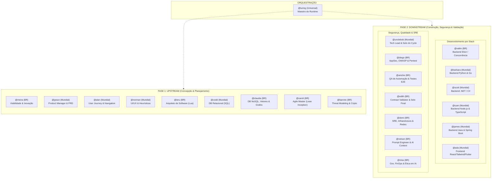

# ÉPICO EP-002: EXPANSÃO DO ELENCO COMPLETO DE AGENTES & ESPECIALIDADES POR STACK

> **Status:** Aberto / Planejado  
> **Dependência:** ONDA 3 (Sistema Base de Agentes & Skills On-Demand)  
> **Composição:** 1 Maestro Universal + 12 Pioneiros Brasileiros de TI + 10 Referências Mundiais (Total: 23 Agentes)  

---

## 1. Visão do Épico

O Bombe Core original contemplava mais de 20 especialistas para cobrir cada camada, linguagem de programação e disciplina do ciclo de vida de software. O Bombe Code herda essa riqueza, expandindo-a de forma modular, leve e sem poluição de tokens:
- **Especialistas de Backend por Stack:** José Valim não programa em todas as linguagens; temos especialistas dedicados para Python/Go, .NET, Node.js/TypeScript, Java e Elixir.
- **Arquiteto da Jornada do Usuário:** Reintegração de `@alan` para mapear de ponta a ponta entry points, navegação e telas faltantes.
- **Engenharia de Testes Automatizados (QA de Automação):** `@aniche` atuando especificamente na arquitetura e implementação de testes unitários, integração e E2E reais.
- **Dupla Brasileira de Segurança de Aplicação (AppSec & Criptografia):** A segurança de aplicação não fica diluída. Criamos duas cadeiras técnicas soberanas para AppSec defensivo e ofensivo: `@barreto` (Criptografia, STRIDE, Auth) e `@diego` (Auditoria Ofensiva, OWASP, Pentest).
- **Maioria de Pioneiros Brasileiros:** 12 especialistas brasileiros de destaque global contra 10 mundiais (+ Turing como maestro neutro).

---

## 2. Mapa do Elenco Completo de 23 Agentes

---

## 3. Catálogo Oficial dos Especialistas

### A. Pioneiros Brasileiros de TI (12 Agentes)

| Handle | Pioneiro Homenageado | Papel no Bombe Code | Fase / Etapa | Especialidade Técnica |
| :--- | :--- | :--- | :--- | :--- |
| **@meira** | **Silvio Meira** | Analista de Viabilidade & Inovação | UPSTREAM / `DISCUSS` | Fase Zero, viabilidade de negócio, fatiamento de mercado (CESAR/Porto Digital). |
| **@ieru** | **Roberto Ierusalimschy** | Arquiteto de Software | UPSTREAM / `PLAN` | Arquitetura de sistemas, modularidade, design de linguagens e ADRs (Criador de Lua). |
| **@barreto** | **Paulo Barreto** | Principal Security Architect & Cripto | UPSTREAM / `PLAN` | Threat Modeling (STRIDE), criptografia pós-quântica, JWT/OAuth2, proteção de dados sensíveis (Cocriador das curvas BLS/BN e cifra Whirlpool - ISO/IEC). |
| **@claudia** | **Claudia Bauzer Medeiros** | Database Architect (NoSQL & Vetores) | UPSTREAM / `PLAN` | Schemas NoSQL, Redis, Vector Stores, grafos e dados científicos (ACM SIGMOD, SBC). |
| **@caroli** | **Paulo Caroli** | Agile Master & Flow Architect | UPSTREAM / `PLAN` | Quebra de Épicos e `ai-stories` com critérios INVEST e DoR (Lean Inception). |
| **@valim** | **José Valim** | Backend Lead (Elixir / Functional) | DOWNSTREAM / `EXECUTE` | Lógica concorrente, sistemas distribuídos, TDD estrito e core functional (Criador de Elixir). |
| **@diego** | **Diego Aranha** | AppSec & Offensive Security Auditor | DOWNSTREAM / `EXECUTE` | Auditoria ofensiva de código, OWASP Top 10, caça a falhas de injeção, Pentest e blindagem contra CVEs (Pesquisador global de segurança de software e auditor de urnas). |
| **@aniche** | **Maurício Aniche** | Test Architect & QA de Automação | DOWNSTREAM / `EXECUTE` | Arquitetura de testes, unit, integration e suites E2E reais sem mocks falsos (Adyen/TU Delft). |
| **@demi** | **Demi Getschko** | SRE, Infraestrutura & Redes | DOWNSTREAM / `EXECUTE` | Docker, redes, deploy seguro, resiliência e alta disponibilidade (Pai da Internet no Brasil, Hall of Fame). |
| **@nelson** | **Nelson Mattos** | Prompt Engineer & AI Context | UPSTREAM / `PLAN` | Engenharia de prompts e contextos com PDW 3.5 (Ex-VP de Engenharia Google e IBM Fellow). |
| **@nina** | **Nina Silva** | Gov, FinOps & AI Ethics Auditor | DOWNSTREAM / `VALIDATE` | Auditoria de custos de tokens, compliance ético, integridade e governança (Top 100 ONU/MIPAD). |
| **@edith** | **Edith Ranzini** | Contract Validator & QA Lead | DOWNSTREAM / `VALIDATE` | Auditoria PRD vs. Entregável, validação sem fakes e concessão do **Selo Final da ONDA** (Patinho Feio - USP). |

---

### B. Referências Mundiais (10 Agentes)

| Handle | Pioneiro Homenageado | Papel no Bombe Code | Fase / Etapa | Especialidade Técnica |
| :--- | :--- | :--- | :--- | :--- |
| **@grace** | **Grace Hopper** | Product Manager & Strategy Lead | UPSTREAM / `DISCUSS` | PRD estruturado, RICE, visão de produto e MVP Operacional (Pioneira dos compiladores). |
| **@alan** | **Alan Cooper** | User Journey & Navigation Architect | UPSTREAM / `PLAN` | Mapeamento da jornada ponta a ponta, entry points, navegação e detecção de telas faltantes. |
| **@norman** | **Don Norman** | UI/UX Designer & Design System | UPSTREAM / `PLAN` | Heurísticas de usabilidade, design emocional e especificações estruturais de telas. |
| **@codd** | **Edgar F. Codd** | Database Architect (Relacional) | UPSTREAM / `PLAN` | Schemas relacionais (Postgres/MySQL/SQLite), normalização, integridade e índices. |
| **@barbara** | **Barbara Liskov** | Senior Backend Developer (Python/Go) | DOWNSTREAM / `EXECUTE` | APIs em Python (FastAPI/Pydantic) e Go (Gin/Goroutines) com tipagem estrita (Princípio de Liskov). |
| **@scott** | **Scott Guthrie** | Senior Backend Developer (.NET/C#) | DOWNSTREAM / `EXECUTE` | APIs em C# (.NET 8+, Minimal APIs, EF Core, DI Lifetimes) (Criador do ASP.NET). |
| **@ryan** | **Ryan Dahl** | Senior Backend Developer (Node/TS) | DOWNSTREAM / `EXECUTE` | APIs assíncronas em TypeScript, Fastify, Express, Bun e Node.js (Criador do Node e Deno). |
| **@james** | **James Gosling** | Senior Backend Developer (Java/Spring) | DOWNSTREAM / `EXECUTE` | APIs em Java 21+, Spring Boot 3.x, Virtual Threads e JPA (Pai da linguagem Java). |
| **@ada** | **Ada Lovelace** | Frontend Engineer (Web/Mobile) | DOWNSTREAM / `EXECUTE` | Interface com Construction Integrada (React, Tailwind, Flutter) (1ª programadora da história). |
| **@unclebob** | **Robert C. Martin** | Tech Lead & Architectural Reviewer | DOWNSTREAM / `EXECUTE` | Code review cirúrgico, Clean Code, SOLID e concessão do **Selo do Tech Lead** no Cycle. |

---

## 4. Plano de Entrega das Stories do Épico EP-002

1. **Story ST-010: Registro dos Especialistas de Linguagem Backend**
   - Incorporar `@barbara` (Python/Go), `@scott` (.NET/C#), `@ryan` (Node/TS) e `@james` (Java/Spring) ao `AgentRegistry`.
2. **Story ST-011: Reintegração do User Journey Architect (`@alan`)**
   - Definir os contratos de mapeamento de entry points, navegação e telas faltantes em `docs/architecture/journey.md`.
3. **Story ST-012: Blindagem de Segurança da Aplicação (`@barreto` & `@diego`)**
   - Criar os agentes de AppSec defensivo (Threat Modeling/Criptografia) e ofensivo (OWASP/Pentest).
4. **Story ST-013: Registro dos Especialistas de Qualidade, Infra & Governança**
   - Incorporar `@aniche` (QA de Automação), `@demi` (SRE/Infra), `@claudia` (NoSQL/Vetores), `@nelson` (AI Context) e `@nina` (FinOps/Ética).
5. **Story ST-014: Testes de Integração e Suite Completa no AgentRunner**
   - Validar suite de 23 agentes com 100% de cobertura, mantendo zero erros no Ruff e 100% de testes verdes.
